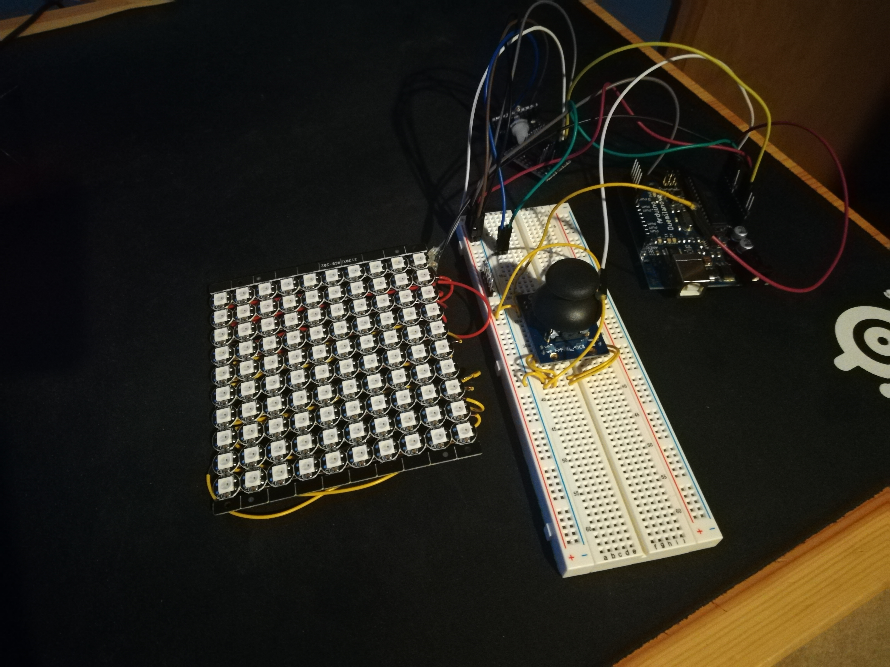

# SnakeLED
My version of Snake implemented with an Arduino using the FastLED library to drive the leds.
When the program is started there is an intro much like a Gameboy or DS intro and then the Game
starts.
The Snake version works just as you would expect it to, without any death from walls and the ability
to "teleport" to the other side when you hit a wall. You will die if you hit yourself.
As the snake gets longer it becomes a more complete rainbow, repeating for every 15 length you get.

This board is currently wired to be controlled by a joystick on a breadboard.

The 10x10 LED array was purchased unsoldered then each node had to be soldered by myself.

Video of the Board in Action
https://www.youtube.com/watch?v=8m-Op82Kzys

